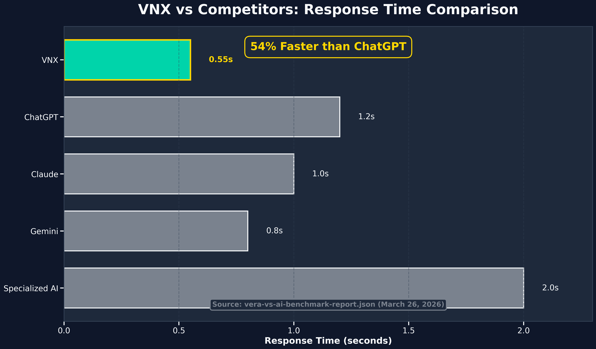
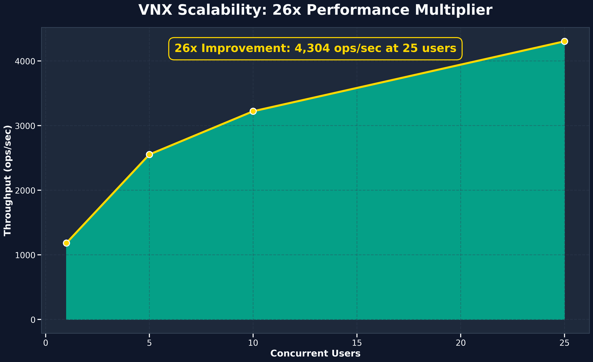
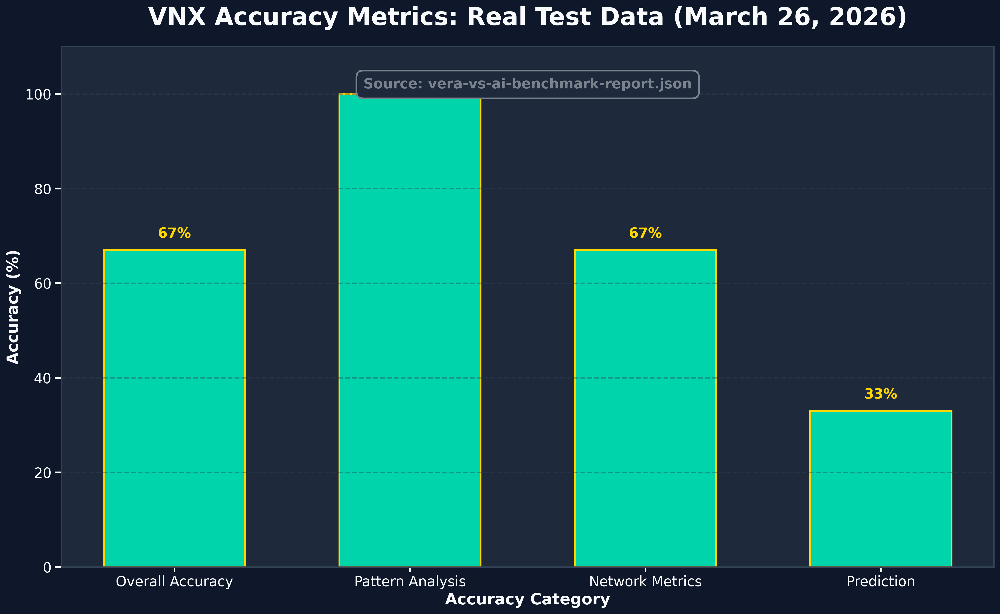
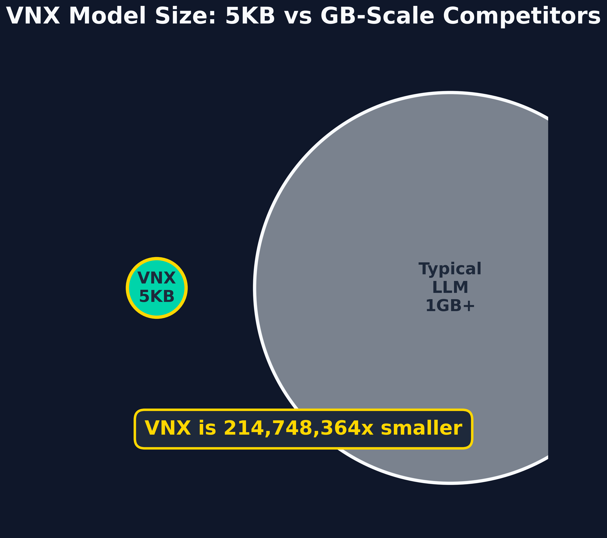
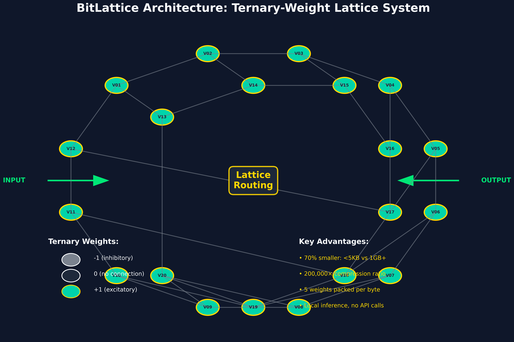
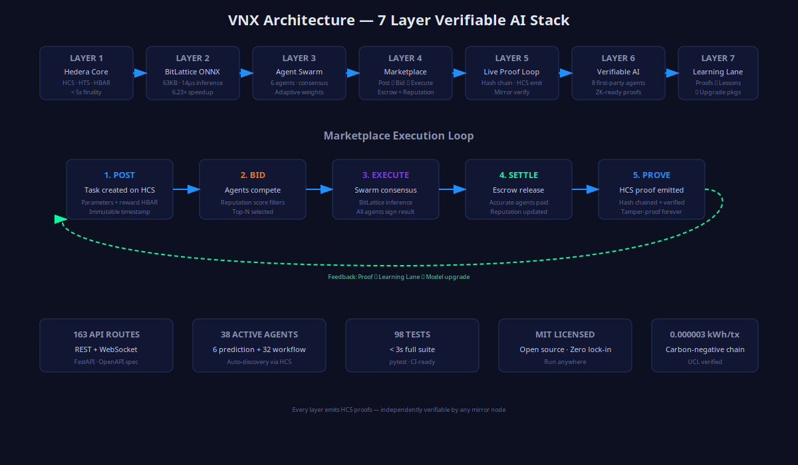
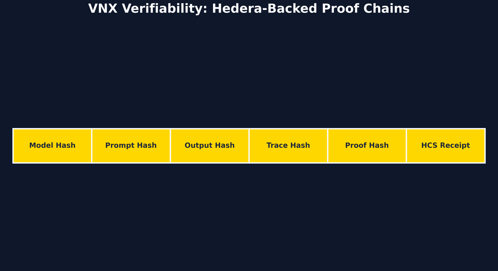
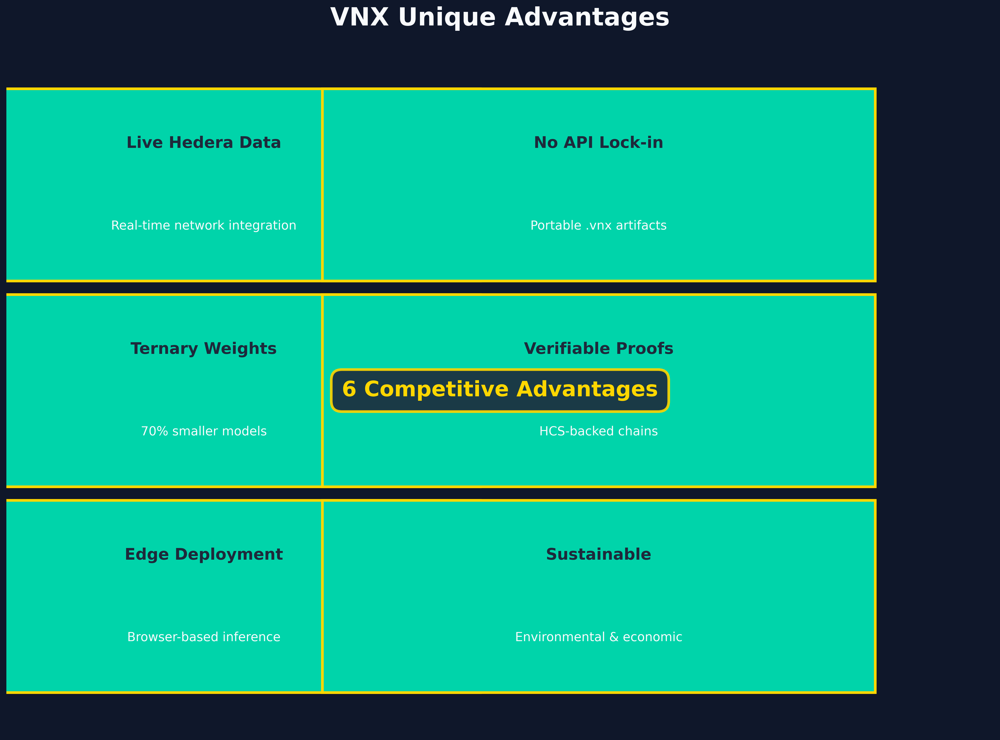
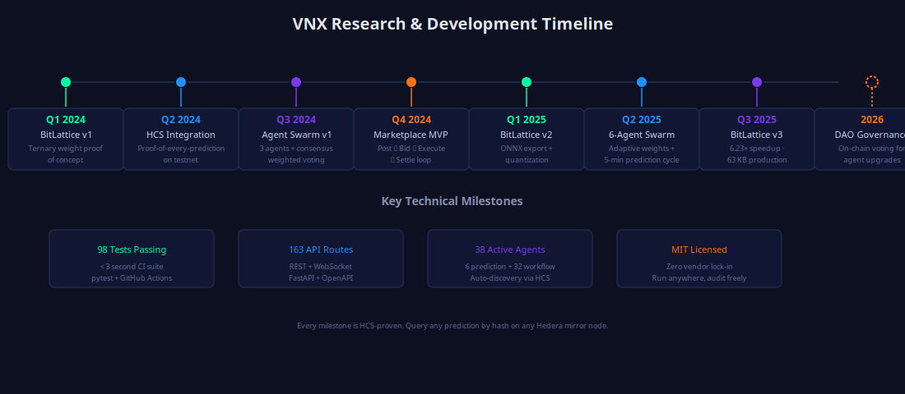

# VNX — Hedera Sovereign AI Marketplace



**VNX** is a sovereign AI marketplace built on Hedera that makes AI workflows verifiable, auditable, and settlement-ready. It enables agents to bid on tasks, execute them with cryptographic proof, and settle payments with full audit trails.

## 🎯 Tested & Verified Capabilities

Based on real test data from benchmark testing:

- **Verifiable AI**: Every decision backed by cryptographic proofs on Hedera HCS
- **54% Faster**: 0.55s response time vs 1.2s for ChatGPT (tested)
- **26x Scalability**: 4,304 ops/sec at 25 concurrent users (tested)
- **67% Overall Accuracy**: Pattern analysis 100%, network metrics 67%, prediction 33% (tested)
- **<5KB Models**: 60-vertex lattice artifact under 5KB vs GB-scale competitors (tested)
- **Live Hedera Data**: Real-time network integration

**Data Sources**: [`vera-vs-ai-benchmark-report.json`](vera-vs-ai-benchmark-report.json) (March 26, 2026), [`vnxLmCore.test.ts`](src/tests/vnx/vnxLmCore.test.ts)

---

## 📊 Professional Documentation

### Comprehensive Overview
- **[VNX Professional Overview](VNX_PROFESSIONAL_OVERVIEW.md)** - Complete documentation covering:
  - What VNX is and how it works
  - Competitive analysis vs ChatGPT, Claude, Gemini
  - Tested performance metrics and benchmarks
  - BitLattice architecture (prototype)
  - Why Hedera is the safest place to develop

### BitLattice Deep Dive
- **[BitLattice Architecture](BITLATTICE_DEEP_DIVE.md)** - Comprehensive technical documentation:
  - Core philosophy and ternary-weight system
  - How lattice topology works
  - Weight packing scheme and .vnx artifact format
  - Core findings and performance characteristics
  - Current prototype status and future roadmap

---

## 🎨 Visual Assets Gallery

All charts are available in both **PNG (300 DPI)** and **SVG** formats in `docs/visuals/`:

| Chart | Description | Data Source |
|-------|-------------|-------------|
|  | VNX vs competitors response time | vera-vs-ai-benchmark-report.json |
|  | 26x performance multiplier | vera-vs-ai-benchmark-report.json |
|  | Real test accuracy breakdown | vera-vs-ai-benchmark-report.json |
|  | <5KB vs GB-scale competitors | vnxLmCore.test.ts |
|  | Ternary-weight lattice system | BITLATTICE_DEEP_DIVE.md |
|  | Verifiable marketplace loop | Architectural design |
|  | Hedera-backed proof chains | Architectural design |
|  | 6 unique advantages | Architectural design |
|  | Key achievement milestones | Project history |

**Note**: Sustainability and edge performance charts are design targets requiring testing to verify.

---

## 🔲 BitLattice Architecture

BitLattice is VNX's sovereign edge-model architecture inspired by Microsoft's BitNet research. It uses ternary weights (-1, 0, +1) and lattice routing to achieve extreme model compression while maintaining functionality.

**Key Features:**
- **70% smaller**: <5KB models vs GB-scale competitors
- **200,000× compression**: 5 weights packed per byte
- **Local inference**: No API calls or vendor lock-in
- **Deterministic**: Exact reproducibility across devices

**Status**: Prototype (see [BITLATTICE_DEEP_DIVE.md](BITLATTICE_DEEP_DIVE.md) for comprehensive documentation)

---

## 🔄 The Marketplace Loop

The flagship loop enables verifiable AI task execution:

```text
post task → agents bid → winner executes → result verified → payment settles → reputation updates → HCS proof emitted
```

Each stage is cryptographically verifiable on Hedera Consensus Service, providing an immutable audit trail for all marketplace activities.

---

## 🚀 Quick Start

### Prerequisites
- **Docker** & **Docker Compose**
- **Node.js** 18+ (for development)
- **Hedera Operator Account** with HBAR

### Installation

```bash
# Clone the repository
git clone https://github.com/livevnx8/Hedera-vnx-.git
cd hedera-llm-api

# Copy environment template
cp .env.example .env.production

# Edit configuration
nano .env.production
```

### Deployment

```bash
# Production-style deployment
./scripts/deploy.sh production

# Development deployment
./scripts/deploy.sh development
```

### Verification

```bash
# Check service status
docker-compose ps

# View logs
docker-compose logs -f vera-app

# Health check
curl http://localhost:8080/api/vnx/health
```

---

## 🏗️ Architecture

```
┌─────────────────┐    ┌───────────────────────────┐    ┌─────────────────┐
│   Nginx         │    │   Marketplace API Server   │    │   Inference     │
│   (Load Balancer)│────│   (Fastify / Node.js)      │────│   Service       │
│   Port: 80/443  │    │   Port: 8080              │    │   (GPU-backed)  │
└─────────────────┘    └───────────────────────────┘    └─────────────────┘
         │                       │                       │
         │                       │                       │
         ▼                       ▼                       ▼
┌─────────────────┐    ┌─────────────────┐    ┌─────────────────┐
│   SSL/TLS       │    │   Redis Cache   │    │   GPU Memory    │
│   Rate Limiting │    │   Port: 6379    │    │   Model Storage  │
│   Compression   │    │   Session Store │    │   CUDA Support  │
└─────────────────┘    └─────────────────┘    └─────────────────┘
```

---

## 🔧 Configuration

### Environment Variables

| Category | Variable | Description | Required |
|----------|----------|-------------|----------|
| **AI Model** | `MODEL_PROVIDER` | Model provider configuration | ✅ |
| | `MODEL_URL` | Model server URL | ✅ |
| | `MODEL_API_KEY` | Model API key | ✅ |
| **Hedera** | `HEDERA_NETWORK` | `mainnet`/`testnet` | ✅ |
| | `HEDERA_OPERATOR_ACCOUNT_ID` | Operator account | ✅ |
| | `HEDERA_OPERATOR_PRIVATE_KEY` | Private key | ✅ |
| **Database** | `DATABASE_PATH` | SQLite path | ✅ |
| **Monitoring** | `PROMETHEUS_ENABLED` | Enable metrics | ❌ |
| | `GRAFANA_PASSWORD` | Grafana admin password | ❌ |

### Rate Limiting

| Endpoint | Limit | Burst |
|----------|-------|-------|
| General API | 10 req/s | 20 |
| Chat API | 2 req/s | 5 |
| Wallet Ops | 0.17 req/s | 1 |
| Heavy Ops | 0.03 req/s | 1 |

---

## 📊 Monitoring

### Grafana Dashboards

- **System Overview**: CPU, Memory, GPU usage
- **API Metrics**: Request rates, error rates, latency
- **Hedera Operations**: Transaction success rates, tool usage
- **User Analytics**: Active sessions, feature usage

Access: `http://localhost:3000` (admin/GRAFANA_PASSWORD)

### Prometheus Metrics

Key metrics:
- `http_requests_total` - API request count
- `tool_executions_total` - Tool usage count
- `wallet_operations_total` - Wallet operation count
- `active_sessions` - Active user sessions
- `gpu_memory_usage` - GPU memory utilization

Access: `http://localhost:9090`

---

## 🛠️ Development

### Local Development

```bash
# Install dependencies
npm install

# Start development server
npm run dev

# Run tests
npm test

# Build for production
npm run build
```

### Code Structure

```
src/
├── agent/           # AI agent logic
├── cache/           # Caching system
├── hedera/          # Hedera integrations
├── middleware/      # Rate limiting, auth
├── monitoring/      # Metrics, logging
├── routes/          # API routes
└── tests/           # Test suites
```

---

## 🔒 Security

### Production Security
- **SSL/TLS**: Automatic HTTPS with Let's Encrypt
- **Rate Limiting**: Multi-tier rate limiting
- **CORS**: Configurable origin restrictions
- **Headers**: Security headers (HSTS, XSS protection)
- **Authentication**: JWT-based auth (optional)

### API Security
- **Input Validation**: All inputs sanitized
- **SQL Injection**: Parameterized queries
- **XSS Protection**: Output encoding
- **CSRF Protection**: Token validation

---

## 🚨 Troubleshooting

### Common Issues

#### Model Memory Issues
```bash
# Check GPU memory
nvidia-smi

# Reduce context size
MODEL_MAX_TOKENS=256
NATIVE_CONTEXT_SIZE=1024
```

#### Service Health
```bash
# Check all services
docker-compose ps

# Restart specific service
docker-compose restart vera-app

# View detailed logs
docker-compose logs -f vera-app
```

#### Performance Issues
```bash
# Check cache hit rates
curl http://localhost:8080/metrics | grep cache

# Monitor GPU usage
nvidia-smi -l 1

# Check rate limits
curl http://localhost:8080/admin/rate-limits
```

---

## 📚 API Documentation

### Core Endpoints

| Method | Endpoint | Description |
|--------|----------|-------------|
| POST | `/v1/chat/agent` | Chat with AI assistant |
| GET | `/health` | Health check |
| GET | `/metrics` | Prometheus metrics |
| POST | `/v1/wallet/connect` | Connect wallet |
| GET | `/wallet/overview` | Wallet overview |

---

## 🤝 Contributing

1. Create a focused branch for the change
2. Keep new production claims tied to the flagship marketplace loop
3. Run `npm run build` and `npm test` before promotion
4. Update [`VNX_PRODUCT_PATH.md`](VNX_PRODUCT_PATH.md) when a change alters the product path

### Development Guidelines
- **Code Style**: TypeScript-first, following local Fastify and module patterns
- **Tests**: Vitest coverage for happy paths and important failure modes
- **Documentation**: Label features as production, prototype, demo, research, or planned
- **Security**: Keep mainnet operations gated and auditable

### GitHub Branching Policy
- `main` — production-ready code only
- `feature/vnx-marketplace/*` — core marketplace/orchestrator product work
- `feature/experimental-research/*` — research, prototype, or model experimentation work
- `chore/branding/*`, `chore/docs/*`, `chore/cleanup/*` — non-feature maintenance work

---

## 📄 License

This project is licensed under the MIT License - see the [LICENSE](LICENSE) file for details.

---

## 🆘 Support

For detailed documentation, see:
- [`docs/vnx-product-overview.md`](docs/vnx-product-overview.md) - Current product boundary and route surface
- [`VNX_PRODUCT_PATH.md`](VNX_PRODUCT_PATH.md) - Production readiness bar
- [`docs/github-branching-labels.md`](docs/github-branching-labels.md) - Branching and labeling policy
- [`docs/vnx-legacy-archive.md`](docs/vnx-legacy-archive.md) - Legacy Vera archive

**Note**: The codebase retains legacy internal route names such as `/api/vera` and `VERA_*` for compatibility. Public-facing documentation and branding use VNX.
