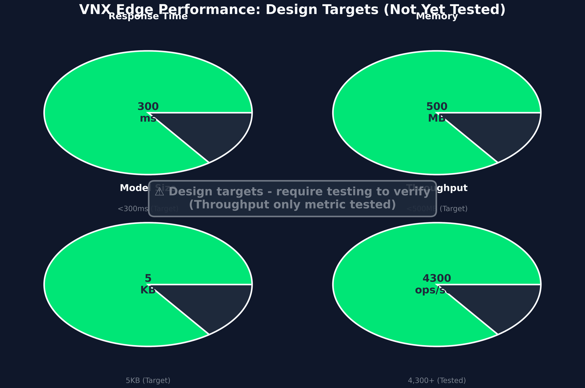
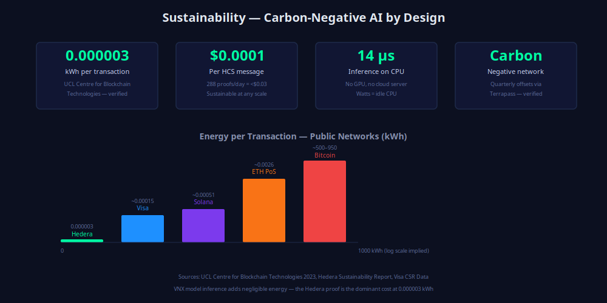

# Vera OS



**Verifiable prediction infrastructure for Hedera-native AI agents.**

Vera OS packages the working Hedera prediction API, VNX model swarm, Hedera specialist agents, health checks, cache, resilience layer, metrics, dashboards, alerts, and production Docker stack into one easy-to-review repository.

It is built for three jobs:

- **Predict:** serve token direction forecasts through a FastAPI API and the `PredictionService` Python facade.
- **Specialize:** monitor Hedera with `HederaSpecialistSwarm`, a 27-agent micro-specialist swarm covering infrastructure, market, security, governance, and cross-chain signals.
- **Operate:** run the same system with PostgreSQL, Redis, Prometheus, Grafana, Loki, Jaeger, Alertmanager, Traefik, backups, and release validators.

## What Is Included

| Area | Included |
| --- | --- |
| Prediction engine | HBAR/SAUCE/DOVU model loading, feature computation, confidence scoring, token health |
| Hedera specialists | 27 micro-specialists with aggregate status, alert counts, confidence, and latency |
| API service | `/predict/{token}`, `/tokens`, `/health`, `/metrics`, analytics, graph, governance, agent, swarm, and Hedera endpoints |
| Production infrastructure | 13 Docker services with PostgreSQL, Redis, Redis exporter, Traefik, Prometheus, Grafana, Loki, Promtail, Jaeger, Node Exporter, Alertmanager, and backup |
| Observability | 20 Prometheus metrics, 11 alert rules, Grafana provisioning, Loki logs, Jaeger tracing |
| Release quality | Infrastructure validator, smoke tests, Vera OS release validator, professional PNG/SVG visual inventory |

## Quick Start

```bash
git clone https://github.com/livevnx8/Hedera-vnx-.git
cd Hedera-vnx-
bash quickstart.sh        # creates venv, installs, verifies — one command
```

Or step by step:

```bash
python3 -m venv .venv && source .venv/bin/activate
pip install -e ".[production]"
make verify               # runs all 3 validation suites
```

**Try it out:**

```bash
make predict              # sample HBAR prediction
make visuals              # list 11 professional visual assets
make swarm                # inspect 27-agent Hedera specialist swarm
```

**Start the full Docker stack:**

```bash
make infra-up             # Vera + Redis + PostgreSQL + Grafana + Prometheus + Loki + Jaeger
```

## Python Facade

The public `vera_os` package gives developers stable import points without needing to understand the internal file layout.

```python
from vera_os import PredictionService, HederaSpecialistSwarm, get_visual_assets

assets = get_visual_assets()
print(assets[0].title, assets[0].png)

swarm = HederaSpecialistSwarm()
print(swarm.status()["total_specialists"])

prediction = PredictionService()
print(prediction.available_tokens())
```

Available exports:

- `PredictionService`
- `HederaSpecialistSwarm`
- `HealthService`
- `VisualAsset`
- `get_visual_assets`
- `get_visual_asset_pairs`

## Production Deployment

Create a production environment file from your template, set strong secrets, then validate the Compose graph before launch:

```bash
export POSTGRES_PASSWORD="replace-me"
export REDIS_PASSWORD="replace-me"
export GRAFANA_PASSWORD="replace-me"

docker compose -f docker-compose.production.yml config
docker compose -f docker-compose.production.yml up -d
```

Core service ports:

| Service | URL |
| --- | --- |
| API | `http://localhost:8080` |
| Prometheus | `http://localhost:9090` |
| Grafana | `http://localhost:3000` |
| Jaeger | `http://localhost:16686` |
| Alertmanager | `http://localhost:9093` |

## API Surface

| Endpoint | Purpose |
| --- | --- |
| `GET /predict/{token}` | Run a token prediction with live features |
| `GET /tokens` | List loaded token models and accuracy metadata |
| `GET /health` | Prediction engine health |
| `GET /metrics` | Prometheus metrics |
| `GET /analytics/market` | Market-wide analytics |
| `GET /analytics/{token}` | Token-level analytics |
| `GET /graph/*` | Chart and historical data |
| `GET /features/*` | Feature importance, drift, and engineering data |
| `GET /governance/*` | Governance and validation surfaces |
| `GET /hedera/*` | Hedera toolkit and agent endpoints |
| `GET /hedera-swarm/*` | Hedera specialist swarm status, execution, and alerts |

## Hedera Specialist Families

`HederaSpecialistSwarm` wraps the advanced Hedera VNX orchestrator. The current swarm includes specialists for:

- Hedera infrastructure: HCS consensus, HTS tokens, network health, staking, contracts, and transaction volume
- Market intelligence: volatility, trend, momentum, support/resistance, correlation, liquidity, sentiment, and regime detection
- Security and risk: whale watch, flash-loan detection, reentrancy guard, anomaly detection, and rug-pull prediction
- Governance and economics: proposal tracking, treasury monitoring, inflation tracking, fee optimization, and yield monitoring
- Cross-chain health: bridge health and wrapped asset monitoring

## Visual Assets

Every public visual is available as both high-resolution PNG and editable SVG in `docs/visuals/`.

| Visual | PNG | SVG |
| --- | --- | --- |
|  | [PNG](docs/visuals/vnx-architecture-diagram-png.png) | [SVG](docs/visuals/vnx-architecture-diagram-svg.svg) |
|  | [PNG](docs/visuals/vnx-performance-comparison-png.png) | [SVG](docs/visuals/vnx-performance-comparison-svg.svg) |
|  | [PNG](docs/visuals/vnx-accuracy-metrics-png.png) | [SVG](docs/visuals/vnx-accuracy-metrics-svg.svg) |
|  | [PNG](docs/visuals/vnx-bitlattice-architecture-png.png) | [SVG](docs/visuals/vnx-bitlattice-architecture-svg.svg) |
|  | [PNG](docs/visuals/vnx-competitive-advantage-grid-png.png) | [SVG](docs/visuals/vnx-competitive-advantage-grid-svg.svg) |
|  | [PNG](docs/visuals/vnx-model-size-comparison-png.png) | [SVG](docs/visuals/vnx-model-size-comparison-svg.svg) |
|  | [PNG](docs/visuals/vnx-scalability-visualization-png.png) | [SVG](docs/visuals/vnx-scalability-visualization-svg.svg) |
|  | [PNG](docs/visuals/vnx-verifiability-diagram-png.png) | [SVG](docs/visuals/vnx-verifiability-diagram-svg.svg) |
|  | [PNG](docs/visuals/vnx-sustainability-infographic-png.png) | [SVG](docs/visuals/vnx-sustainability-infographic-svg.svg) |
|  | [PNG](docs/visuals/vnx-research-timeline-png.png) | [SVG](docs/visuals/vnx-research-timeline-svg.svg) |
|  | [PNG](docs/visuals/vnx-edge-performance-dashboard-png.png) | [SVG](docs/visuals/vnx-edge-performance-dashboard-svg.svg) |

See [Visual Assets](docs/visual-assets.md) for usage guidance.

## Validation

Use the validators before publishing, tagging, or sharing a release candidate:

```bash
python3 tests/validate_vera_os_release.py
python3 tests/validate_infrastructure.py
python3 tests/smoke_test.py
```

The release validator checks `vera_os` imports, examples, docs, README image links, and PNG/SVG integrity. The infrastructure validator checks Compose, monitoring, alerts, migrations, and production wiring.

## Repository Map

| Path | Purpose |
| --- | --- |
| `vera_os/` | Public Python facade |
| `examples/` | Small developer examples |
| `prediction_server_v3.py` | FastAPI application surface |
| `hedera_vnx_specialists*.py` | Hedera specialist swarm implementations |
| `src/health/`, `src/cache/`, `src/resilience/`, `src/metrics/` | Health, cache, circuit breaker, and metrics modules |
| `infrastructure/postgres/` and `alembic/` | Database schema and migrations |
| `monitoring/` | Prometheus, Grafana, Loki, Promtail, alerts |
| `docs/visuals/` | Professional PNG and SVG visual assets |

## Security Notes

- Do not commit `.env`, `.env.production`, private keys, operator IDs, or API tokens.
- Use strong values for `POSTGRES_PASSWORD`, `REDIS_PASSWORD`, and `GRAFANA_PASSWORD`.
- Treat live Hedera mainnet operations as production actions and keep them gated, logged, and auditable.
- Public claims should stay tied to checked artifacts, benchmark files, or docs that explain their status.

## More Documentation

- [Vera OS Overview](docs/vera-os-overview.md)
- [Prediction Infrastructure](docs/prediction-infrastructure.md)
- [Hedera Specialists](docs/hedera-specialists.md)
- [Visual Assets](docs/visual-assets.md)
- [Model Artifacts](docs/model-artifacts.md)
- [GitHub Release Checklist](docs/github-release-checklist.md)
- [Build Manifest](BUILD_MANIFEST.md)
- [Infrastructure Completion Report](INFRASTRUCTURE_COMPLETE.md)

## License

This project is released under the MIT License. See [LICENSE](LICENSE).
